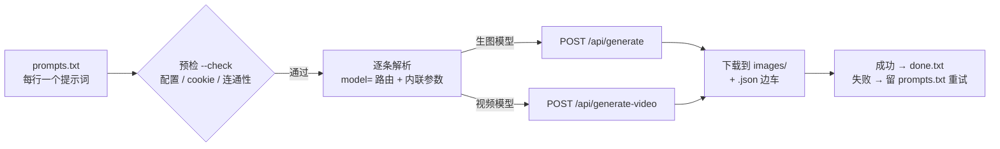
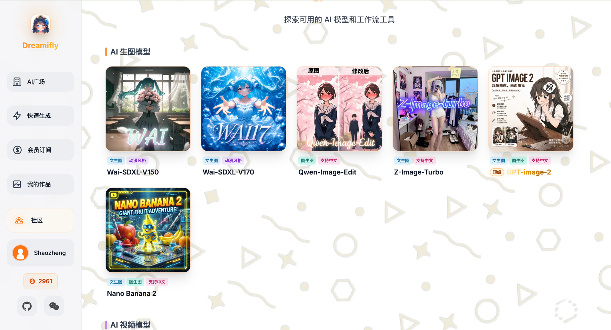
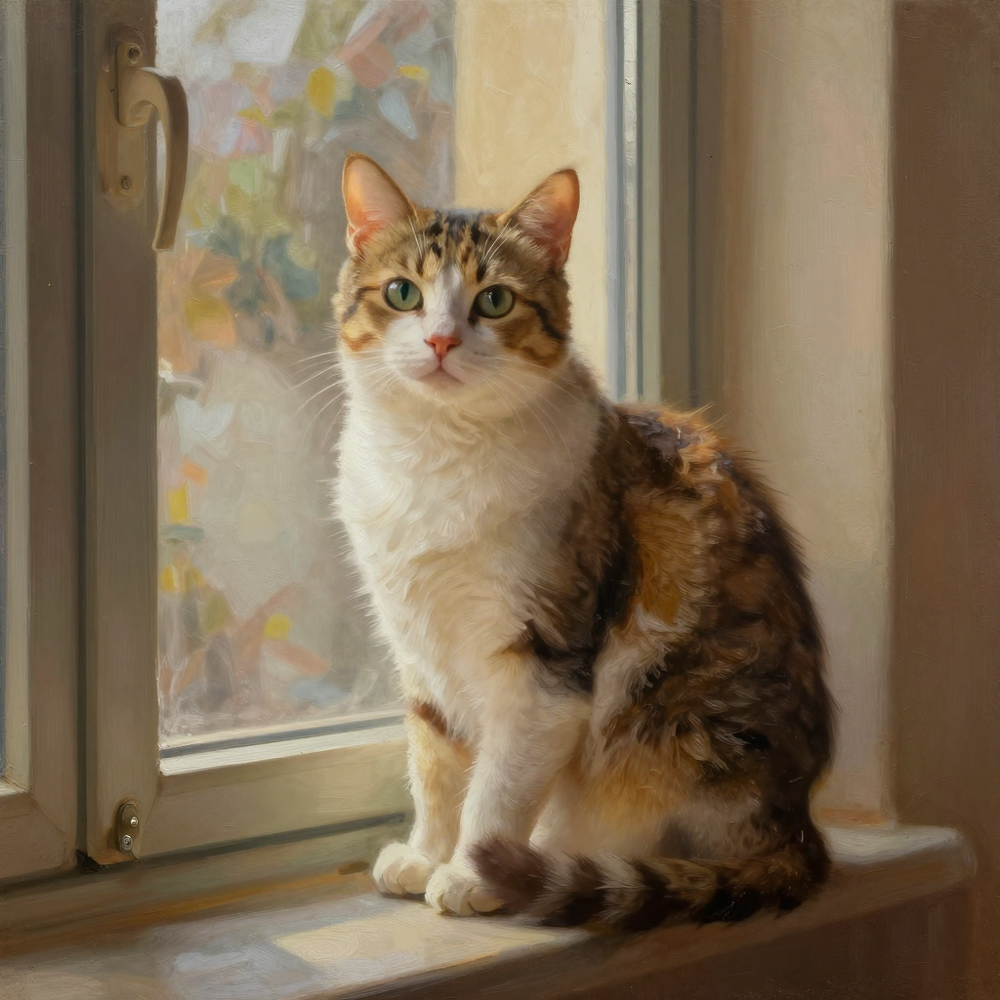
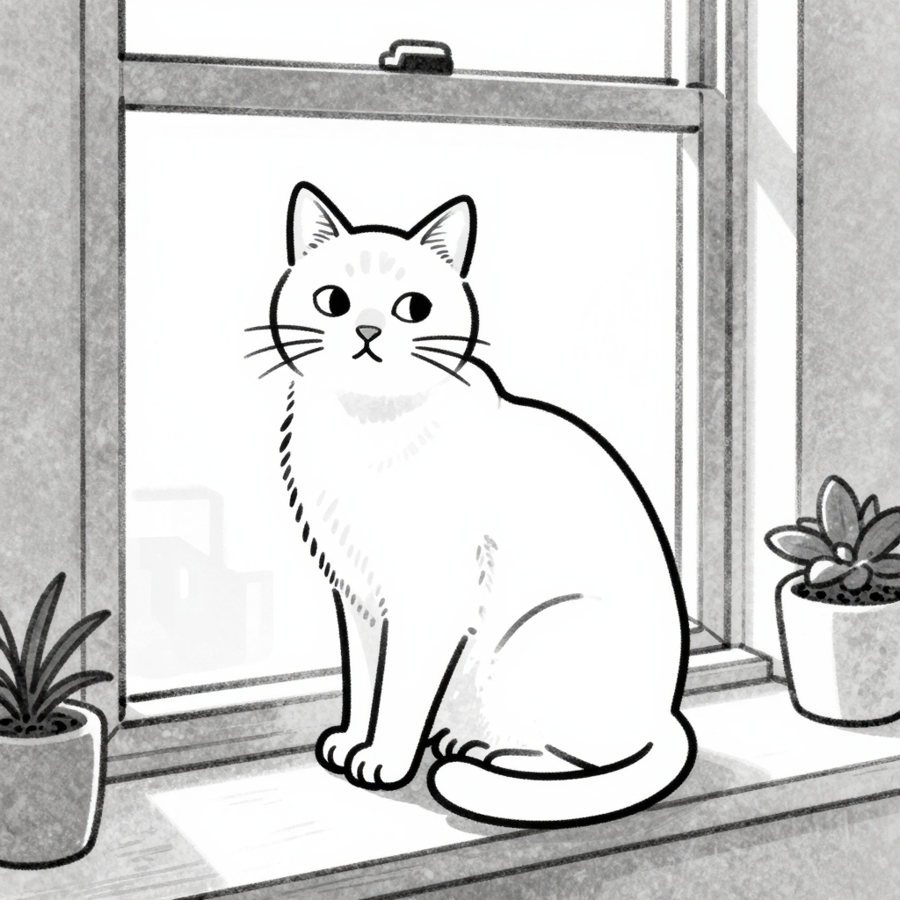
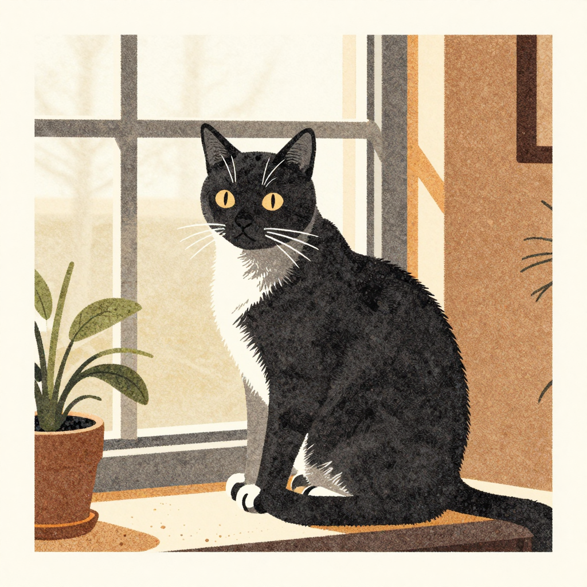

# dreamifly-batch


从一个提示词列表，批量调用 [Dreamifly](https://dreamifly.com) 的 **生图 / 生视频** API 逐条生成并下载。
排队、节流、自动重试、断点续跑、开跑前预检、多模型路由——把提示词写进 `prompts.txt`，跑一条命令就行。

| | |
|---|---|
| 🌐 Dreamifly 官网 | https://dreamifly.com |
| 📦 本仓库 | https://github.com/shaozheng0503/dreamifly-batch |
| 🌍 English | [README_EN.md](./README_EN.md) |

> 🤖 本仓库同时是一个 **[Claude Code](https://claude.com/claude-code) Skill / Codex Agent 工具**：
> 装好后，你只要对 AI 说"用这批提示词批量生图 / 用这张图生成视频"，它就会自动调用本工具。
> 详见 [在 AI 里使用](#在-ai-里使用)。
> 🐍 **零依赖**：只需 Python 3，全部标准库，无需 `pip install`。

## ✨ 特性

- 🎨 **8 个模型 + 11 种风格**：6 生图 + 2 视频，叠加卡通/动漫/油画/像素/乐高… 风格，一处切换
- 📝 **队列式**：`prompts.txt` 每行一个提示词，逐条出图，`#` 注释、空行自动跳过
- 🎚️ **逐行内联参数**：`| model= | 16:9 | x2 | seed= | img= | secs= | res=`，每行独立覆盖
- 🛫 **开跑前预检**：`--check` 校验配置/模型/cookie/连通性，不让你白跑半批
- 🧪 **零成本预演**：`--dry-run` 看清每条会怎么生成，不调 API、不花积分
- ⬇️ **自动下载 + 边车**：图片/视频落地，旁边写 `.json` 记录模型/seed/参数，可复现
- ✅ **断点续跑**：成功移入 `done.txt`，失败留在 `prompts.txt` 下次自动重试
- 🤖 **AI 原生**：自带 `SKILL.md` / `AGENTS.md`，Claude Code、Codex、自定义 Agent 都能直接调用

---

## 目录

- [工作原理](#工作原理)
- [示例](#示例)
- [支持的模型](#支持的模型)
- [风格预设](#风格预设)
- [准备：获取登录态 Cookie（最重要）](#准备获取登录态-cookie最重要)
- [快速开始](#快速开始)
- [输出与产物](#输出与产物)
- [切换模型教程](#切换模型教程)
- [提示词内联参数](#提示词内联参数)
- [命令行](#命令行)
- [配置文件](#配置文件)
- [在 AI 里使用](#在-ai-里使用)
  - [在 Claude Code 里使用](#在-claude-code-里使用)
  - [在 Codex 里使用](#在-codex-里使用)
  - [让你自己的 Agent 学会调用](#让你自己的-agent-学会调用)
- [鉴权原理](#鉴权原理)
- [常见问题与排错](#常见问题与排错)
- [注意事项](#注意事项)

---

## 工作原理



---

## 示例

**文生图**（Wai-SDXL-V150 等）

| 提示词 | 出图 |
|---|---|
| `a serene japanese garden at sunset, koi pond, soft golden light` |  |

**图生图**（`img=` 传参考图，提示词 `transform ... into a snowy winter scene, frozen koi pond`）

| 参考图（输入） | 出图（输出） |
|---|---|
|  |  |

**文生视频**（happyhorse-1.0 · `a cinematic timelapse of a city skyline at sunset` · 5s 720P，真实生成）


▶️ [完整视频 sample-t2v-city-sunset.mp4](./docs/sample-t2v-city-sunset.mp4)（1280×720 · h264 · 5s）

**图生视频**（Wan2.2-I2V-Lightning · 用上面那张庭院图 + `gentle wind, koi swimming, falling leaves` · 真实生成）

| 源图（输入） | 生成视频（输出） |
|---|---|
|  |  |

▶️ [完整视频 sample-i2v-garden.mp4](./docs/sample-i2v-garden.mp4)（1280×720 · h264）

---

## 支持的模型

平台「探索可用的 AI 模型」页面（随时用 `python3 dreamify.py --list-models` 拉取在线最新列表）：




### 生图（`/api/generate`）

| 模型 | 能力 | maxImg | steps | 需登录 | 约积分 |
|---|---|:-:|:-:|:-:|:-:|
| `Wai-SDXL-V150` | 文生图 · 动漫风格 | 0 | 20 | 否 | ~0.1 |
| `Wai-SDXL-V170` | 文生图 · 动漫风格 | 0 | 20 | 否 | ~0.1 |
| `Z-Image-Turbo` | 文生图 · 中文 · 快 | 0 | 10 | 否 | ~0.325 |
| `Qwen-Image-Edit` | 图生图 · 中文 | 3 | — | 否 | ~1.2 |
| `gpt-image-2` | 文生图 + 图生图 · 中文 | 3 | — | 是 | 顶级 |
| `nano-banana-2` | 文生图 + 图生图 · 中文 | 3 | — | 是 | ~25+ |

> `steps` 由脚本按模型自动填（Wai 必须 20、Z-Image-Turbo 10），无需手填。

### 生视频（`/api/generate-video`，单价高、较慢）

| 模型 | 模式 | 参数 | 约积分 |
|---|---|---|:-:|
| `Wan2.2-I2V-Lightning` | 图生视频（**需 1 张源图**） | — | ~200 |
| `happyhorse-1.0` | 文/图/多参考图生视频 + 视频编辑 | `secs`(3–15) `res`(720P/1080P) | ~150 起 |

视频模式按输入自动推导：无图→文生视频，1 张图→图生视频，多张图→多参考图生视频。

---

## 风格预设

平台「风格」下拉的 **11 种风格**都已接入，用 `style=` 选择（中英文名均可），脚本会把风格描述自动加到提示词前。

同一句提示词 `a cat sitting by a window` + 不同 `style=`（Z-Image-Turbo 真实生成）：

| 动漫 `anime` | 油画 `oil` | 街机像素 `pixel` |
|:---:|:---:|:---:|
|  |  |  |
| **乐高 `lego`** | **线稿 `lineart`** | **Riso噪点 `riso`** |
|  |  |  |

全部 11 种（`style=` 值，中英文都认；`--list-models` 也能查）：

| 值 | 风格 | 值 | 风格 |
|---|---|---|---|
| `cartoon` | 卡通 | `lego` | 乐高积木 |
| `anime` | 动漫 | `riso` | Riso噪点插画 |
| `oil` | 油画 | `realistic` | 现实风格 |
| `lineart` | 线稿 | `puppet` | 布偶风格 |
| `vector` | 矢量线条 | `emoji` | Emoji图标风格 |
| `pixel` | 街机像素 | | |

用法：`a cat by a window | style=oil | model=Z-Image-Turbo`（或全局 `--style oil`）。

---

## 准备：获取登录态 Cookie（最重要）

部分模型（`gpt-image-2`、`nano-banana-2`）和**所有视频模型**都要求登录。脚本通过你浏览器的
**登录态 Cookie** 来鉴权。免登录模型（Wai、Z-Image-Turbo、Qwen-Image-Edit）可跳过这一步。

> 鉴权用的 `Authorization` token 脚本会**自动计算**，你**不需要**手动获取——你唯一要提供的就是这个 Cookie。

**第 1 步｜注册并登录**
打开 https://dreamifly.com ，用左下角的 GitHub / 微信 等方式登录。登录后左下角会显示你的用户名和**积分**
（例如截图里的 `2961`）。积分不足时生图/视频会返回 402。

**第 2 步｜打开浏览器开发者工具**
在 dreamifly.com 页面按 `F12`（Mac：`Cmd+Option+I`），切到 **Network（网络）** 标签页。

**第 3 步｜触发一个请求并复制 Cookie**
1. 刷新页面，或点一下「快速生成 / AI 广场」让页面发请求。
2. 在 Network 列表里点任意一个发往 `dreamifly.com` 的请求（如 `models`、`time`）。
3. 右侧找到 **Headers → Request Headers（请求标头）**，找到 **`Cookie:`** 这一行。
4. **复制 `Cookie:` 后面的一整行内容**（很长，包含 `session=...; token=...` 等多段）。

> 备选：开发者工具 **Application（应用）/ 存储 → Cookies → https://dreamifly.com**，也能看到各项；
> 但 Network 里的 `Cookie` 请求头是已拼好的整行，直接复制最省事。

**第 4 步｜写入 `config/cookie.txt`**
```bash
cp config/cookie.txt.example config/cookie.txt
```
编辑 `config/cookie.txt`，把复制的整行粘进去（**不要**带前面的 `Cookie:` 字样），保存。
以 `#` 开头的行会被忽略，脚本取第一条非注释行作为 Cookie。

**第 5 步｜验证**
```bash
python3 dreamify.py --check
```
看到 `✅ 已加载 cookie（N 字符）` 和 `✅ 连通正常` 即可。Cookie 会过期，遇到 401 重新取一次即可。

⚠️ Cookie 等同于你的登录凭证。它已被 `.gitignore` 排除，**切勿提交或分享**。

---

## 快速开始

```bash
git clone https://github.com/shaozheng0503/dreamifly-batch.git
cd dreamifly-batch

# 1) （需登录的模型才需要）按上文填好 config/cookie.txt
cp config/cookie.txt.example config/cookie.txt   # 然后编辑填入

# 2) 看有哪些模型、先预检
python3 dreamify.py --list-models
python3 dreamify.py --check

# 3) 写提示词（每行一个，可指定模型）
echo "anime girl with flowers | model=Wai-SDXL-V150" >> prompts.txt

# 4) 跑（全部 / 只跑前 3 条）
./run.sh
./run.sh 3
```

结果在 `images/`，成功记录在 `done.txt`，失败的留在 `prompts.txt` 下次自动重试。

---

## 输出与产物

每次成功生成会落地两个文件：媒体本体 + 同名 `.json` 边车（记录参数，便于复现/检索）。

```
images/
├── 20260619_122149_masterpiece_1girl_..._0.png    # 图片
├── 20260619_122149_masterpiece_1girl_..._0.json   # 边车
├── 20260619_125051_gentle_wind_koi_..._0.mp4      # 视频
└── 20260619_125051_gentle_wind_koi_..._0.json
done.txt   # 成功记录：时间 \t 提示词 \t 文件名
run.log    # 运行日志（含每条的模型/seed/错误）
```

边车 `.json` 示例（图生视频）：
```json
{
  "type": "video",
  "prompt": "gentle wind, koi swimming slowly, falling leaves, cinematic",
  "model": "Wan2.2-I2V-Lightning",
  "videoMode": "image-to-video",
  "width": 1280, "height": 720, "aspectRatio": "16:9",
  "source_image": "docs/sample-japanese-garden.png",
  "generated_at": "2026-06-19T12:50:51"
}
```

> `images/`、`done.txt`、`run.log` 都已被 `.gitignore` 排除，不会误传你的产物。

---

## 切换模型教程

有三种方式指定模型，**优先级：内联参数 > 命令行 flag > config.json**。

**方式一：在某一行提示词里临时指定（最灵活，可逐行不同模型）**
```text
# prompts.txt —— 每行可以用不同模型
masterpiece, 1girl, sakura | model=Wai-SDXL-V150
a photo of a cat, 中文也支持 | model=Z-Image-Turbo
edit this, add snow | model=Qwen-Image-Edit | img=ref.png
a cat running | model=Wan2.2-I2V-Lightning | img=source.png
city timelapse | model=happyhorse-1.0 | secs=5 | res=720P
```

**方式二：本次运行全局指定（不写进文件）**
```bash
python3 dreamify.py --model Wai-SDXL-V170 --aspect 16:9
```

**方式三：改默认模型（长期生效）**
编辑 `config/config.json` 的 `"model"` 字段，例如改成 `"Z-Image-Turbo"`。

> 模型名大小写不敏感（`wai-sdxl-v150` 也行）。拿不准就先 `--list-models`，再 `--dry-run` 预演确认路由。

---

## 提示词内联参数

在 `prompts.txt` 一行内用 `|` 分隔，逐条覆盖配置，可任意组合。`#` 开头的行和空行会被忽略（可用于注释/暂存）。

| 片段 | 含义 | 适用 |
|---|---|---|
| `model=...` | 选择模型（生图或视频） | 全部 |
| `style=...` | 风格预设（cartoon/anime/oil/pixel/lego… 或中文名，见[风格预设](#风格预设)） | 全部 |
| `16:9` | 宽高比，脚本会**自动换算出匹配的宽高**再发（这样比例才真正生效） | 全部 |
| `1024x768` | 显式宽 x 高，**优先级高于比例**，原样使用 | 全部 |

> **关于宽高比**：平台按 `width × height` 出图，单给 `aspectRatio` 而宽高仍是方形会出方图。
> 因此脚本在你只给比例（如 `16:9`）时，会按所选模型的原生像素预算换算出匹配宽高（如 gpt-image-2 → 1536×864）。
> 平台预设比例：`16:9 21:9 4:3 3:2 5:4 1:1 4:5 2:3 3:4 9:16 9:21`；需要精确像素时用 `1024x768` 这种显式写法。
| `x2` | 生成 2 张（≤4） | 生图 |
| `seed=123` | 固定随机种子 | 生图 |
| `steps=20` | 采样步数（一般自动） | 生图 |
| `neg=...` | 负向提示词 | 全部 |
| `img=路径或URL` | 参考图/源图，逗号分隔多张（本地/URL/data，自动转 base64） | 图生图 / 图生视频 |
| `secs=5` | 视频时长秒（happyhorse 3–15） | 生视频 |
| `res=720P` | 视频分辨率（happyhorse：720P / 1080P） | 生视频 |

---

## 命令行

```bash
python3 dreamify.py --list-models           # 列出平台所有可用模型（在线）
python3 dreamify.py --check                  # 只做开跑前预检
python3 dreamify.py --dry-run               # 解析预演，不调用 API
python3 dreamify.py                          # 跑完队列全部
python3 dreamify.py 3                         # 只跑前 3 条（等价 -n 3）
python3 dreamify.py --model Wai-SDXL-V150 --aspect 16:9   # 全局覆盖
python3 dreamify.py --no-sidecar             # 不写 .json 边车
python3 dreamify.py --prompts other.txt --images-dir out/   # 自定义路径
```

---

## 配置文件

`config/config.json`：

| 字段 | 说明 | 默认 |
|---|---|---|
| `model` | 默认模型 | `gpt-image-2` |
| `width` / `height` | 生图宽高（与 `aspectRatio` 一致时直接用；不一致则以比例换算） | `1024` / `1024` |
| `aspectRatio` | 生图宽高比（驱动出图形状，脚本据此换算宽高） | `1:1` |
| `batch_size` | 每条生成几张（≤4） | `1` |
| `steps` | 采样步数（null=按模型自动） | `null` |
| `negative_prompt` | 负向提示词 | `""` |
| `delay_between_seconds` | 每条之间节流间隔 | `5` |
| `max_retries` | 单条失败最大重试 | `2` |
| `request_timeout_seconds` | 生图请求超时 | `300` |
| `video_width` / `video_height` | 视频宽高 | `1280` / `720` |
| `video_aspectRatio` | 视频宽高比 | `16:9` |
| `video_seconds` | 视频默认时长（happyhorse） | `5` |
| `video_resolution` | 视频默认分辨率 | `720P` |
| `video_timeout_seconds` | 视频请求超时（排队可能久，建议留足） | `1800` |

---

## 在 AI 里使用

本仓库自带 `SKILL.md`（Claude Code 技能定义）和 `AGENTS.md`（Codex / 通用 Agent 指令）。
核心很简单：**让 AI 把提示词写进 `prompts.txt`，然后运行 `python3 dreamify.py`，再读 `run.log` 汇报。**

### 在 Claude Code 里使用

**安装为技能（推荐，可被自动调用）：**
```bash
./install.sh            # 安装到 ~/.claude/skills/dreamifly-batch（用户级，全局可用）
./install.sh .claude    # 或安装到 当前项目/.claude/skills（仅本项目）
```
安装后在 Claude Code 里自然语言触发即可：

> 👤：用这 3 个提示词各出一张动漫图：樱花少女、赛博城市、雪山
> 🤖：（自动）`--check` 预检 → 写入 `prompts.txt`（带 `model=Wai-SDXL-V150`）→ `./run.sh` → 读日志汇报：成功 3/3，图片在 `images/`

也可以不安装，直接 clone 后对 Claude 说：「用这个目录里的 `dreamify.py` 批量生图」，Claude 会读 `SKILL.md` 按流程执行。

### 在 Codex 里使用

OpenAI Codex CLI 会自动读取仓库根目录的 **`AGENTS.md`**。本仓库已内置，所以：

```bash
git clone https://github.com/shaozheng0503/dreamifly-batch.git
cd dreamifly-batch
codex          # 在仓库目录里启动 codex
```
然后直接说：

> 用 happyhorse-1.0 把 "a sunset timelapse over the city" 生成一个 5 秒 720P 视频

Codex 会参照 `AGENTS.md`：先 `python3 dreamify.py --check`，把提示词（带 `model=` / `secs=` / `res=`）写进
`prompts.txt`，运行 `./run.sh`，最后读 `run.log` 告诉你视频在 `images/`。
（视频较贵，Codex 会在跑之前提示大致积分消耗。）

### 让你自己的 Agent 学会调用

本工具对 Agent 没有任何特殊要求——**任何能"读写文件 + 跑 shell 命令"的 Agent 都能用**。三步即可教会它：

1. **喂说明书**：把 `SKILL.md`（或 `AGENTS.md`）的内容作为 system prompt / 工具说明给你的 Agent。
2. **给它两个动作**：
   - 写文件：把用户的提示词按内联语法追加到 `prompts.txt`
   - 跑命令：`python3 dreamify.py`（先 `--check`，需要时 `--dry-run`）
3. **让它读结果**：解析 `run.log` 末尾与 `done.txt`，把成功/失败和文件路径回报给用户。

最小「工具定义」示例（任意框架通用）：
```json
{
  "name": "dreamifly_batch_generate",
  "description": "批量调用 Dreamifly 生图/生视频。先把提示词写入 prompts.txt（可用 model=/16:9/x2/img=/secs=/res= 内联参数），再运行脚本。",
  "command": "cd /path/to/dreamifly-batch && python3 dreamify.py",
  "notes": "先 python3 dreamify.py --check 预检；视频(model=Wan2.2-I2V-Lightning/happyhorse-1.0)单价高，运行前先向用户确认。"
}
```
Python 里直接调用也可以：`subprocess.run(["python3", "dreamify.py", "--check"])`。

---

## 鉴权原理

- `Authorization: Bearer MD5(apiKey + 服务器时间串)`：脚本自动从 `/api/time` 取时间串并自行计算，**无需手动获取**。
- `apiKey` 是打进前端、发给每个浏览器的**公开标识**（`NEXT_PUBLIC_API_KEY`），并非私密凭证，随仓库附带。
- `Cookie`：**你个人的登录态**，读自 `config/cookie.txt`（已被 `.gitignore` 排除，请勿提交）。

---

## 常见问题与排错

| 现象 | 原因 | 解决 |
|---|---|---|
| `HTTP 401` / `LOGIN_REQUIRED` | cookie 缺失或已过期 | 按[获取 Cookie](#准备获取登录态-cookie最重要)重新取一次写入 `config/cookie.txt` |
| `HTTP 402` / `INSUFFICIENT_POINTS` | 积分不足 | 充值，或改用免登录模型（`Wai-SDXL-V150` / `Z-Image-Turbo`） |
| `HTTP 400 Invalid steps` | 该模型对步数有硬性要求 | 脚本已按模型自动填；自定义用 `steps=20`/`steps=30`（Wai）、`10`/`20`（Z-Image-Turbo） |
| 视频很慢 / `Connection reset` | 视频排队耗时长（可能 10 分钟以上） | 已默认 `video_timeout_seconds=1800`；失败项会保留，直接重跑即可 |
| 图生图 / 图生视频"没吃参考图" | 模型不支持 i2i 或忘了 `img=` | i2i 用 `Qwen-Image-Edit`/`gpt-image-2`/`nano-banana-2`；i2v 用 `Wan2.2-I2V-Lightning` 且必须 `img=` |
| 模型名报错 / 路由不对 | 名字拼错 | `--list-models` 查准确 id（大小写不敏感），再 `--dry-run` 预演确认 |
| 中文提示词效果差 | 模型不支持中文 | 用 `Z-Image-Turbo` / `Qwen-Image-Edit` / `gpt-image-2` / `nano-banana-2` |
| 参考图被拒 | 单图超过 10MB | 压缩到 10MB 以内；最多 9 张 |

> 拿不准时的万能三连：`--list-models` → 写好 `prompts.txt` → `--dry-run` 预演 → `--check` 预检 → 正式跑。

---

## 注意事项

- ⚠️ **不要把 `config/cookie.txt` 提交到任何公开仓库**——它等同于你的登录凭证。
- 💸 **视频很贵**：`Wan2.2-I2V-Lightning` 约 200 积分/次、`happyhorse-1.0` 约 150 起，生成也较慢；脚本对视频**不自动重试**以免重复扣费。
- 图生图（`img=`）已实测：参考图可为本地文件 / URL / `data:`URI，自动转无前缀 base64；单图 ≤10MB、最多 9 张、需登录。
- 积分不足（402）或登录失效（401）时脚本会立即停止并说明原因，已成功的不受影响。
- 失败的提示词会保留在 `prompts.txt`，直接重跑即可续跑。

## License

[MIT](./LICENSE)
