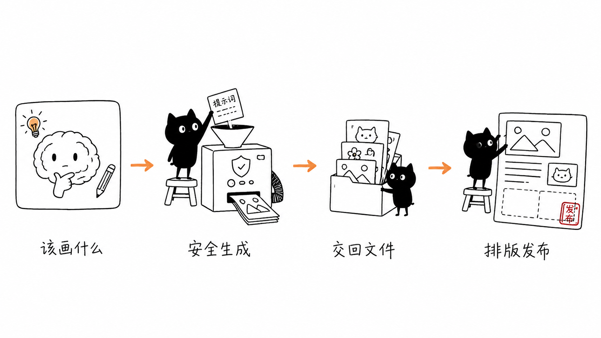
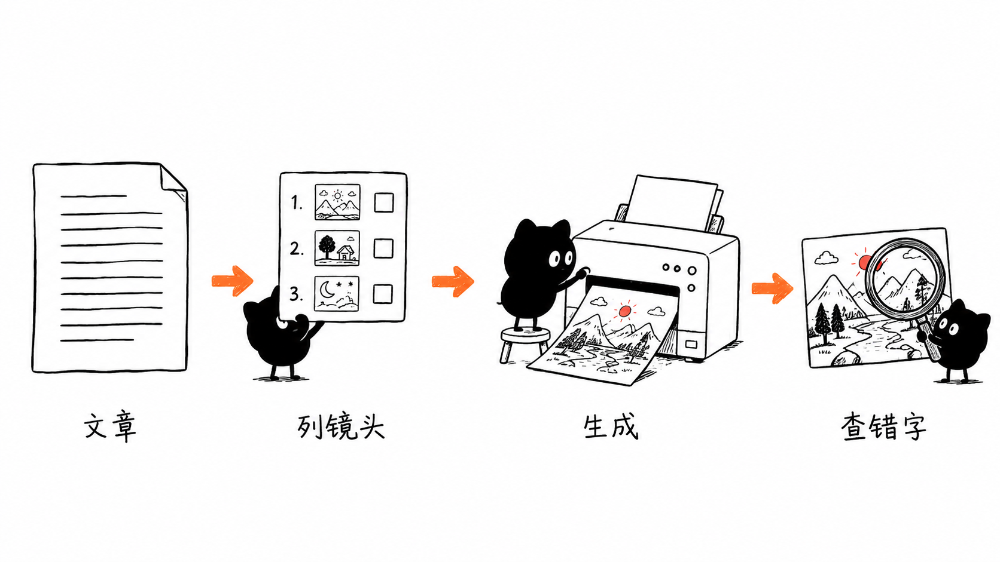
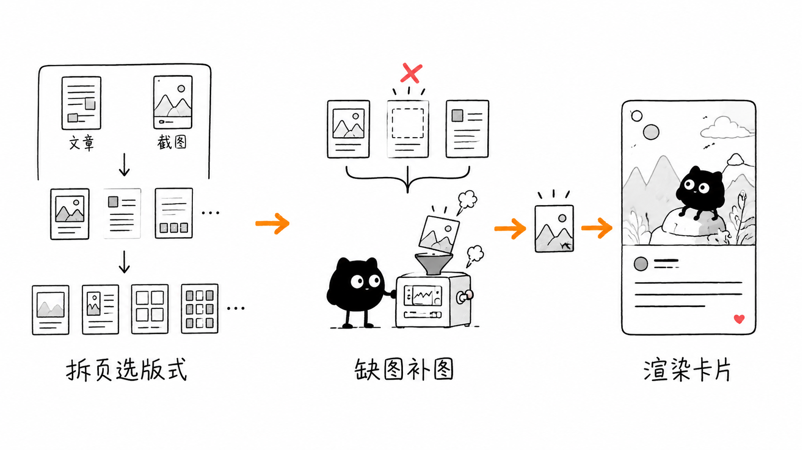
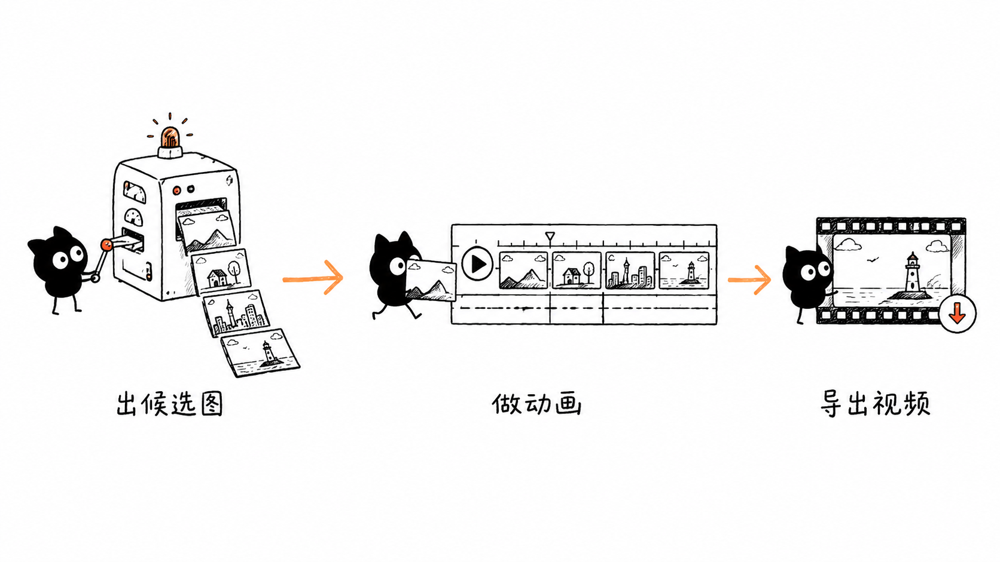

# 为什么把一个生图网站做成 Agent Skill

> 这份文档不讲怎么用（怎么用看 [README](../README.md) 和 [SKILL.md](../SKILL.md)），只讲一件事：**为什么要把 Dreamifly 接进 Agent，以及它想卡的位置。**
> 配套阅读：[`skill-ecosystem.md`](./skill-ecosystem.md)（联动细节）、[`xiaohei-integration.md`](./xiaohei-integration.md)（实测案例）。

---

## 一句话

Dreamifly 本来是个生图/生视频网站——偏二次元、本质是"在网页里点点点"。`dreamifly-batch` 做的事，是把它**接进 Agent 生态**：做成一个任何 Agent 都能调用的 Skill，让"生图/生视频"从一个网页操作，变成 agent 工作流里能直接调用的一环。

## 在赌什么

生图平台现在基本都是"产品形态"：网页、APP、模型社区。你要图，得自己去网站点。

但在 Agent 时代，生图越来越不该是"人去网站点"，而该是"**agent 干活时顺手调一下**"——写文章顺手配图、做 PPT 顺手出封面、做短剧顺手批量出分镜。

`dreamifly-batch` 赌的就是这个转变：**生图平台的下一个入口，不是更好看的网页，而是"能被 agent 调用"。** 谁先把这个入口做出来，谁就先卡住位置。

## 能用在哪（两类场景）

1. **用户自己的生图/生视频工作流**：在 Claude Code / Cursor / Codex 里一句话批量出图、图生图、文生视频，不用切回网页。
2. **作为别的 Skill 的生图一环**：上游 skill 负责"该画什么"（文章配图、社交卡片、PPT、短剧分镜），它负责"把图安全稳定地生成出来"，再把文件交回去。已跑通：`ian-xiaohei-illustrations`、`guizang-social-card-skill`、`baoyu-design`、AI 漫剧分镜。

## 怎么和别的 Skill 联动

和别的 Skill 的关系永远是同一句话：**上游 skill 决定"该画什么"，`dreamifly-batch` 负责"把图安全生成出来、交回文件"，下游继续排版/发布。** 上游不用碰模型调用、下载、重试、成本确认，只管内容和审美。

下面是三条已经跑通的具体链路。

### 中文正文配图（`ian-xiaohei-illustrations` 这类）

上游的"小黑插画"skill 读文章、提炼认知锚点、列 shot list、写每张图的 prompt，并用 QA checklist 盯标题 / 错字 / 留白；`dreamifly-batch` 用 `gpt-image-2` 把每条 prompt 出成最终图，回传文件让上游做 QA。

> 这篇文档里的小黑插图，全部就是走这条链路生成的。

### 社交图文卡片（`guizang-social-card-skill` 这类）

上游的卡片 skill 先把文章 / 截图拆页、选版式、规划每页要什么图；**只在缺合适照片或图库素材时**，才让 `dreamifly-batch` 补封面图、章节图、背景图；卡片 skill 再渲染成 3:4 / 21:9 的成品 PNG。它只在"缺图"那一步介入，不抢排版。

### 图素材 → 动画视频（`baoyu-design` 这类）

`dreamifly-batch` 先批量出几张候选场景图，挑好的喂进上游的时间轴动画流程，最后导出 MP4。短剧分镜也是同一套：先低成本探索关键帧，关键镜头再升级到高质量模型。

### 内容 / 大纲 → 网页 PPT（`guizang-ppt-skill` 这类）

`guizang-ppt-skill` 生成单文件 HTML 翻页 deck，版式里有明确的图片槽位（`S22` 21:9 主视觉、`S15/S16` 多图格）。它决定哪页要图、放哪个槽位、要什么比例；`dreamifly-batch` 按槽位比例批量出图、回传文件路径，再填进 deck。比例对齐是关键：S22 用 21:9、多图格统一比例。

> 上图是无文字、无品牌的通用占位配图；真实 deck 的图与数据在本地管理，不入库。详见 [`skill-ecosystem.md`](./skill-ecosystem.md)。

## 凭什么（卖点）

一句话：**别把它当"又一个生图工具"，把它当"为 agent 而生的生图后端"**——只突出那些"调用方是机器、不是人"时才值钱的点。

- **接入方便**：纯文件 + CLI、零依赖。任何能读写文件、跑 shell 的 agent 都能用（`.cursor/` / `.claude/` / `AGENTS.md` 各有现成入口）。
- **模型聚合 + 图视频统一**：一个口子里既有国产模型，也有 `gpt-image-2`、`nano-banana-2` 这类海外顶级模型，图、视频通吃——上游 skill 不用自己对接一堆模型。
- **批量可靠**：断点续跑、失败重试、缓存去重，几十上百条的批量配图/分镜才是刚需。
- **结构化交接**：每条任务落一行 `results.jsonl` + 同名 `.json` 边车，下游 skill 直接读路径和参数，不用人肉翻文件夹——这是"能当别人后端"的关键。
- **成本不失控**：`--estimate` 预估、高成本任务先确认、视频不自动重试，交给 agent 批量跑也不会悄悄超支。

## 生态卡位：对比即梦、Liblib

|  | 即梦 / Liblib 这类生图平台 | dreamifly-batch |
|---|---|---|
| 为谁优化 | 人盯着屏幕点 | **agent 自动调用** |
| 主入口 | 网页 / APP / 模型社区 | **Agent Skill（被调用）** |
| Agent 接入 | 基本还没当入口做 | **率先做 Skills 化接入** |

即梦、Liblib 更大更成熟，但它们都是"产品先行"，还没把"我是一个能插进 Claude Code / Codex 的 Skill"当成入口。`dreamifly-batch` 抢的就是这个时间差——在生图平台里率先把"agent 接入"这条路走通，相当于**在"生图平台"和"agent 生态"之间架一座桥**。

**但要诚实**：率先接入是时间差，不是终局；即梦/Liblib 体量更大，真要做 Skill 化未必慢。所以别空喊先发，趁这个窗口把**联动案例做厚**——让"要在 agent 里生图，就用它"变成习惯和事实标准。

## 还要想清楚的（诚实）

- **依赖单一平台**：绑定 Dreamifly 的模型和积分体系，平台一变就受影响。
- **联动还偏手工**：现在跨 skill 串联多半要人来牵线，离"上游 skill 自动调它生图"还有距离——这正是接下来要做厚的地方。

---

## 一句话收尾

`dreamifly-batch` 不是又一个生图工具，而是一次**入口形态的押注**：把生图从"网页产品"搬成"agent 能调用的能力"。在即梦、Liblib 还在比网页和模型的时候，先把这座通往 agent 的桥架起来。
